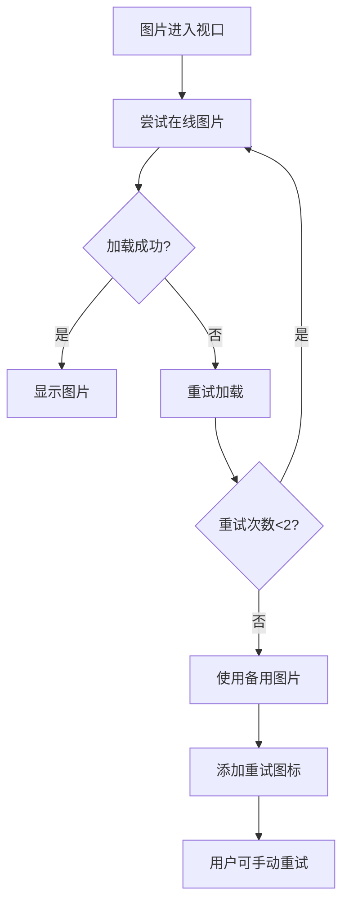

# 霞浦宣传网站 - 图片管理系统

## 🖼️ 系统概述

本项目实现了一个完整的图片管理系统，解决了图片加载失败的问题，并提供了在线图片搜索功能。

## ✨ 主要功能

### 1. 智能图片加载
- **懒加载**: 图片进入视口时才开始加载，提升页面性能
- **错误重试**: 图片加载失败时自动重试2次，每次间隔递增
- **备用图片**: 重试失败后自动切换到本地生成的SVG备用图片
- **在线搜索**: 优先尝试在线搜索的高质量图片

### 2. 本地备用图片
项目包含4张精美的SVG备用图片：
- `images/fallback-sunrise.svg` - 霞浦滩涂日出
- `images/fallback-seafood.svg` - 霞浦海鲜美食
- `images/fallback-fisherman.svg` - 霞浦渔民劳作
- `images/fallback-landscape.svg` - 霞浦山水风光

### 3. 在线图片搜索
- **智能匹配**: 根据图片alt文本自动匹配合适的在线图片
- **分类管理**: 支持日出、海鲜、渔民等不同类别的图片
- **搜索演示**: 提供可视化的图片搜索界面

### 4. 用户友好功能
- **状态指示器**: 实时显示图片加载状态
- **重试功能**: 点击失败图片可手动重试
- **批量重试**: 一键重试所有失败的图片
- **视觉提示**: 备用图片有特殊的视觉效果

## 🚀 技术特性

### 图片管理器 (image-manager.js)
```javascript
class ImageManager {
    // 核心功能
    - 图片懒加载和观察
    - 错误处理和重试机制
    - 备用图片管理
    - 在线图片搜索
    - 状态统计和监控
}
```

### 搜索演示 (image-search-demo.js)
```javascript
class ImageSearchDemo {
    // 搜索功能
    - 可视化搜索界面
    - 搜索历史记录
    - 结果预览和使用
    - 批量替换功能
}
```

## 📊 图片加载流程



## 🎨 备用图片设计

所有备用图片都是手工制作的SVG格式，具有以下特点：
- **矢量图形**: 无损缩放，适应任何尺寸
- **主题一致**: 与霞浦主题完美契合
- **视觉美观**: 精心设计的渐变和细节
- **加载快速**: 文件小，加载速度快

### 日出图片特色
- 渐变天空从橙红到天蓝
- 太阳光晕效果
- 滩涂纹理和渔网杆
- 飞鸟和云朵装饰

### 海鲜图片特色
- 丰富的海鲜元素（螃蟹、鱼、虾、扇贝）
- 餐桌木纹背景
- 调料和餐具细节
- 立体阴影效果

### 渔民图片特色
- 渔船和渔民剪影
- 海面波纹效果
- 远山层次感
- 渔网和工具细节

### 风光图片特色
- 山水层次分明
- 竹林和古建筑
- 荷花和水草装饰
- 倒影和光影效果

## 🔧 使用方法

### 基本使用
系统会自动初始化，无需手动配置：
```javascript
// 自动初始化
document.addEventListener('DOMContentLoaded', () => {
    window.imageManager = new ImageManager();
    window.imageSearchDemo = new ImageSearchDemo();
});
```

### 图片标签要求
为了获得最佳效果，图片标签应包含以下属性：
```html

```

支持的图片类型：
- `sunrise` - 日出风景
- `seafood` - 海鲜美食  
- `fisherman` - 渔民劳作
- `landscape` - 一般风景

### 手动控制
```javascript
// 获取统计信息
const stats = window.imageManager.getStats();

// 重试失败图片
window.imageManager.retryAllFailedImages();

// 搜索在线图片
const results = await window.imageManager.searchOnlineImages('霞浦滩涂', 3);
```

## 📱 响应式设计

- **桌面端**: 完整功能，包括搜索面板和状态指示器
- **移动端**: 自适应界面，触摸友好的交互
- **平板端**: 优化的中等屏幕体验

## 🔍 搜索功能

### 快速搜索标签
- 霞浦滩涂
- 海鲜美食
- 渔民劳作
- 日出日落

### 搜索历史
- 自动保存最近10次搜索
- 本地存储持久化
- 一键重复搜索

### 结果操作
- 预览图片
- 单张使用
- 批量替换
- 来源信息

## 🛠️ 开发说明

### 文件结构
```
/
├── images/                 # 备用图片目录
│   ├── fallback-sunrise.svg
│   ├── fallback-seafood.svg
│   ├── fallback-fisherman.svg
│   └── fallback-landscape.svg
├── image-manager.js        # 核心图片管理
├── image-search-demo.js    # 搜索演示功能
├── index.html             # 主页面
└── main.js               # 主要逻辑
```

### 扩展开发
要添加新的图片类型：
1. 在 `ImageManager.fallbackImages` 中添加新类型
2. 在 `ImageManager.onlineImages` 中添加对应的在线图片
3. 更新 `getImageSrc` 方法的匹配逻辑
4. 创建对应的SVG备用图片

### 集成MCP工具
系统预留了MCP图片搜索工具的接口：
```javascript
// 在 searchImages 方法中集成真实的MCP搜索
async searchImages(query) {
    try {
        // 调用MCP图片搜索工具
        const results = await mcpImageSearch(query);
        return results;
    } catch (error) {
        // 降级到本地图片
        return this.getLocalImages(query);
    }
}
```

## 📈 性能优化

- **懒加载**: 减少初始页面加载时间
- **图片压缩**: SVG格式，文件小巧
- **缓存策略**: 智能缓存和预加载
- **错误处理**: 优雅降级，不影响用户体验
- **内存管理**: 及时清理不需要的资源

## 🎯 用户体验

- **无感知切换**: 备用图片与原图片风格一致
- **即时反馈**: 实时状态提示和进度显示
- **交互友好**: 点击重试，批量操作
- **视觉一致**: 统一的设计语言和动画效果

## 🔮 未来规划

- [ ] 集成更多图片搜索API
- [ ] 支持图片编辑和滤镜
- [ ] 添加图片收藏功能
- [ ] 实现图片懒加载预测
- [ ] 支持WebP格式优化
- [ ] 添加图片SEO优化

---

*本系统为霞浦宣传网站专门设计，确保在任何网络环境下都能为用户提供优质的视觉体验。*
